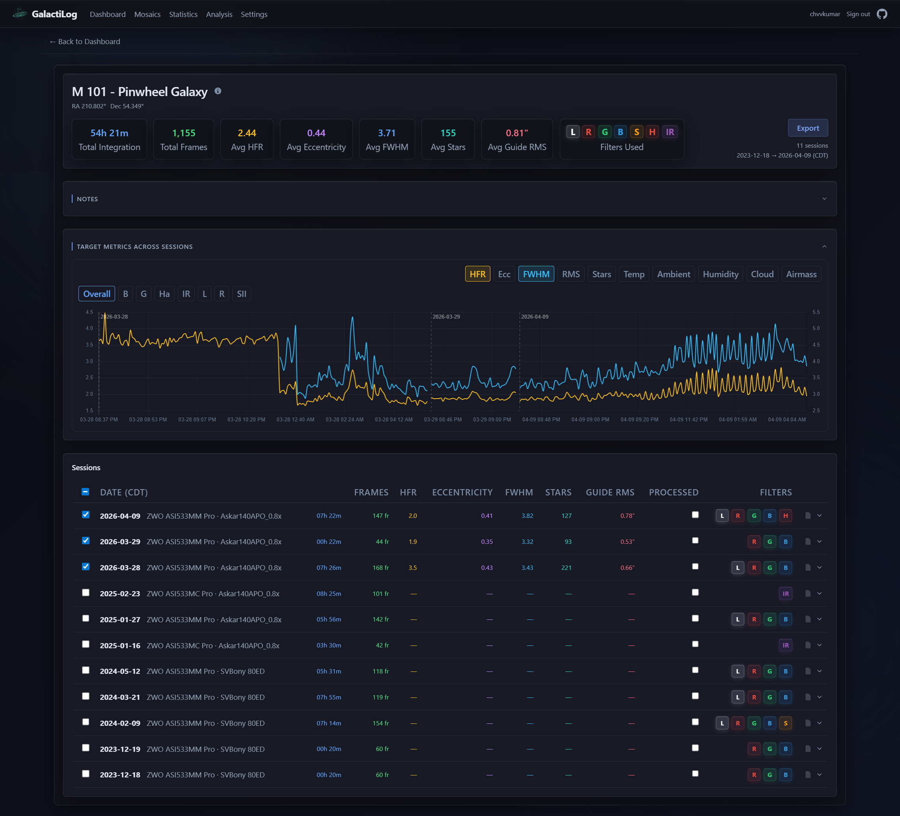

<p align="center">
  
</p>

<h3 align="center">Astrophotography FITS file catalog and session browser</h3>

<p align="center">
  Self-hosted web application that automatically catalogs FITS files from<br>
  N.I.N.A. imaging sessions and provides detailed analytics for your astrophotography data.
</p>

<p align="center">
  <a href="https://github.com/chvvkumar/GalactiLog/releases/latest"></a>
  <a href="https://github.com/chvvkumar/GalactiLog/actions/workflows/build-deploy.yml?query=branch%3Amain"></a>
  <a href="https://hub.docker.com/r/chvvkumar/galactilog"></a>
  <a href="https://hub.docker.com/r/chvvkumar/galactilog"></a>
</p>

<p align="center">
  
  
  
  
  
  
  
</p>

---

## Features

### Automatic Ingestion
- Scans directories for FITS files and extracts metadata from headers
- Backfills extended metrics from N.I.N.A. CSV session logs (HFR, FWHM, detected stars, guiding RMS, ADU statistics)
- Configurable auto-scan scheduler with adjustable intervals

### Target Resolution
- Resolves object names to canonical designations via the SIMBAD database
- Maintains aliases, catalog IDs (Messier, NGC, IC, Caldwell, Sharpless, etc.), and common names
- Detects potential duplicate targets using trigram similarity scoring

### Session Analytics
- Per-session quality metrics: HFR, FWHM, eccentricity, detected stars, guiding RMS (total, RA, Dec)
- Environmental monitoring: ambient temperature, humidity, dew point, pressure, wind speed, cloud cover, sky quality
- Equipment tracking: sensor temperature, gain, focuser position/temperature, rotator position, pier side, airmass
- ADU statistics: mean, median, standard deviation, min, max
- Session insights with quality warnings and indicators

### Statistics Dashboard
- Total integration time, frame counts, and target summaries
- Filter usage distribution with per-filter integration hours
- Equipment inventory with frame counts per camera and telescope
- Monthly imaging timeline trends
- Storage breakdown across FITS data, thumbnails, and database
- Ingest history tracking

### Advanced Filtering
- Fuzzy target search with alias matching
- Object type, date range, filter, and equipment filters
- Quality and environmental metric range filters
- Raw FITS header query builder (=, !=, >, <, contains, etc.)

### Customization
- Per-group metric visibility toggles (Quality, Guiding, ADU, Focuser, Weather, Mount)
- Filter and equipment name aliasing with color customization

## Screenshots

### Catalog

<p align="center">
  <em>Dashboard -- target catalog with advanced filtering, filter palettes, and equipment profiles</em><br>
  
</p>

### Session Metrics

<table align="center">
  <tr>
    <td align="center" width="50%">
      <em>Target Metrics -- quality trends across sessions with multi-metric charting</em><br>
      
    </td>
    <td align="center" width="50%">
      <em>Session Metrics -- per-frame data table, session insights, and interactive charts</em><br>
      
    </td>
  </tr>
</table>

### Mosaics

<table align="center">
  <tr>
    <td align="center" width="50%">
      <em>Mosaic browser -- panel detection, keyword-based suggestions, and per-panel integration tracking</em><br>
      
    </td>
    <td align="center" width="50%">
      <em>Mosaic detail -- panel layout visualization with thumbnail grid and per-panel session data</em><br>
      
    </td>
  </tr>
  <tr>
    <td align="center" width="50%">
      <em>Mosaic detail -- two-panel mosaic with integration summary and filter breakdown</em><br>
      
    </td>
    <td></td>
  </tr>
</table>

### Analysis & Statistics

<table align="center">
  <tr>
    <td align="center" width="50%">
      <em>Analysis -- correlation explorer with scatter plots, trend lines, and statistical summaries</em><br>
      
    </td>
    <td align="center" width="50%">
      <em>Statistics -- integration totals, equipment performance, filter usage, and storage breakdown</em><br>
      
    </td>
  </tr>
</table>

<p align="center">
  <em>Imaging Timeline -- monthly integration hours with dark-hour efficiency percentages</em><br>
  
</p>

<p align="center">
  <em>Imaging Calendar -- GitHub-style activity heatmap of imaging sessions by day</em><br>
  
</p>

### Settings

<table align="center">
  <tr>
    <td align="center" width="50%">
      <em>Scan &amp; Ingest -- auto-scan scheduler, ingest progress, and maintenance tools</em><br>
      
    </td>
    <td align="center" width="50%">
      <em>Equipment Settings -- duplicate detection, camera and telescope grouping</em><br>
      
    </td>
  </tr>
</table>

## Requirements

- **Docker** and **Docker Compose v2**
- **N.I.N.A.** (Nighttime Imaging 'N' Astronomy) for FITS file generation
- Network access to [SIMBAD](https://simbad.cds.unistra.fr/) for target resolution (cached after first lookup per target)

GalactiLog reads FITS headers directly and optionally backfills extended metrics from CSV files generated by the [Session Metadata](https://github.com/tcpalmer/nina.plugin.sessionmetadata) plugin. See the [N.I.N.A. Setup Guide](guides/NINA-SETUP.md) for details.

## Quickstart

```bash
# 1. Download the example compose file
curl -O https://raw.githubusercontent.com/chvvkumar/GalactiLog/main/docker-compose.example.yml

# 2. Copy and edit for your system (lines marked "<-- CHANGE")
cp docker-compose.example.yml docker-compose.yml
# Edit docker-compose.yml: set your FITS path, admin password, and port

# 3. Start
docker compose up -d

# 4. Open http://localhost:8080
```

Migrations run automatically on first start. Log in with the admin credentials from the compose file and trigger your first scan from Settings.

See the [Install Guide](guides/INSTALL.md) for platform-specific paths, version pinning, building from source, and troubleshooting.

## Guides

- [Install Guide](guides/INSTALL.md) -- Installation, updating, uninstalling, and troubleshooting
- [N.I.N.A. Setup Guide](guides/NINA-SETUP.md) -- Configuring N.I.N.A. for use with GalactiLog
- [Configuration Guide](guides/CONFIGURATION.md) -- Environment variables, themes, filter/equipment aliases, and display settings
- [Security Guide](guides/security.md) -- Authentication, HTTPS, cookie security, and user management

## Tech Stack

| Layer | Technology |
|-------|-----------|
| Frontend | SolidJS, TypeScript, Tailwind CSS v4, Chart.js, Vite |
| Backend | FastAPI, SQLAlchemy 2.0 (async), asyncpg, PostgreSQL 16 |
| Task Queue | Celery, Redis |
| Infrastructure | Docker Compose, Nginx, Supervisor |

## Acknowledgements

- **[SIMBAD](https://simbad.cds.unistra.fr/)** -- CDS, Strasbourg, France ([Wenger et al., 2000, A&AS, 143, 9](https://ui.adsabs.harvard.edu/abs/2000A%26AS..143....9W))
- **[VizieR](https://vizier.cds.unistra.fr/)** -- CDS, Strasbourg, France (DOI: [10.26093/cds/vizier](https://doi.org/10.26093/cds/vizier)) ([Ochsenbein et al., 2000, A&AS, 143, 23](https://ui.adsabs.harvard.edu/abs/2000A%26AS..143...23O))
- **[OpenNGC](https://github.com/mattiaverga/OpenNGC)** -- NGC/IC database by Mattia Verga, CC-BY-SA-4.0

## License

This project is for personal use.
