<p align="center">
  
</p>

<h3 align="center">Astrophotography FITS file catalog and session browser</h3>

<p align="center">
  Self-hosted web application that automatically catalogs FITS files from N.I.N.A. imaging sessions and provides detailed analytics for your astrophotography data.
</p>

<table align="center">
  <tr>
    <th></th>
    <th>main (stable)</th>
    <th>dev (pre-release)</th>
  </tr>
  <tr>
    <td><strong>Build</strong></td>
    <td><a href="https://github.com/chvvkumar/GalactiLog/actions/workflows/build-deploy.yml?query=branch%3Amain"></a></td>
    <td><a href="https://github.com/chvvkumar/GalactiLog/actions/workflows/build-deploy.yml?query=branch%3Adev"></a></td>
  </tr>
  <tr>
    <td><strong>Release</strong></td>
    <td><a href="https://github.com/chvvkumar/GalactiLog/releases/latest"></a></td>
    <td><a href="https://github.com/chvvkumar/GalactiLog/releases"></a></td>
  </tr>
  <tr>
    <td><strong>Docker Tag</strong></td>
    <td><a href="https://hub.docker.com/r/chvvkumar/galactilog"></a></td>
    <td><a href="https://hub.docker.com/r/chvvkumar/galactilog"></a></td>
  </tr>
  <tr>
    <td><strong>Image Size</strong></td>
    <td><a href="https://hub.docker.com/r/chvvkumar/galactilog"></a></td>
    <td><a href="https://hub.docker.com/r/chvvkumar/galactilog"></a></td>
  </tr>
</table>

<p align="center">
  <a href="https://hub.docker.com/r/chvvkumar/galactilog"></a>
</p>

<p align="center">
  
  
  
  
  
  
  
</p>

---

<p align="center">
  
</p>

## Features

### Automatic Ingestion
- Scans directories for FITS files and extracts metadata from headers
- Backfills extended metrics from N.I.N.A. CSV session logs (HFR, FWHM, detected stars, guiding RMS, ADU statistics)
- Configurable auto-scan scheduler with adjustable intervals

### Target Resolution
- Resolves object names to canonical designations via the SIMBAD database
- Maintains aliases, catalog IDs (Messier, NGC, IC, Caldwell, Sharpless, etc.), and common names
- Detects potential duplicate targets using trigram similarity scoring

### Session Analytics
- Per-session quality metrics: HFR, FWHM, eccentricity, detected stars, guiding RMS (total, RA, Dec)
- Environmental monitoring: ambient temperature, humidity, dew point, pressure, wind speed, cloud cover, sky quality
- Equipment tracking: sensor temperature, gain, focuser position/temperature, rotator position, pier side, airmass
- ADU statistics: mean, median, standard deviation, min, max
- Session insights with quality warnings and indicators

### Statistics Dashboard
- Total integration time, frame counts, and target summaries
- Filter usage distribution with per-filter integration hours
- Equipment inventory with frame counts per camera and telescope
- Monthly imaging timeline trends
- Storage breakdown across FITS data, thumbnails, and database
- Ingest history tracking

### Advanced Filtering
- Fuzzy target search with similarity scoring and alias matching
- Object type filtering (Galaxy, Emission Nebula, Planetary Nebula, Open Cluster, etc.)
- Date range filtering
- Optical filter selection
- Equipment filtering by camera and telescope
- Quality metric ranges (HFR, FWHM, eccentricity, detected stars, guiding RMS)
- Environmental metric ranges (ambient temperature, humidity, airmass)
- Raw FITS header query builder with operators (=, !=, >, <, contains, etc.) to be able to search sessions based on FITS information

### Customization
- Per-group metric visibility toggles (Quality, Guiding, ADU, Focuser, Weather, Mount)
- Filter and equipment name aliasing with color customization for filters

## Screenshots

### Catalog

<p align="center">
  <em>Dashboard — target catalog with advanced filtering, filter palettes, and equipment profiles</em><br>
  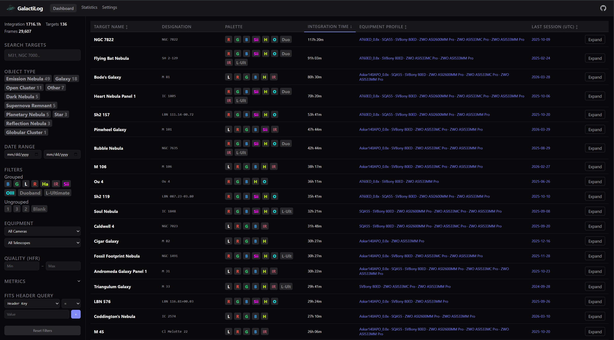
</p>

### Session Metrics

<table align="center">
  <tr>
    <td align="center" width="50%">
      <em>Target Metrics — quality trends across sessions with multi-metric charting</em><br>
      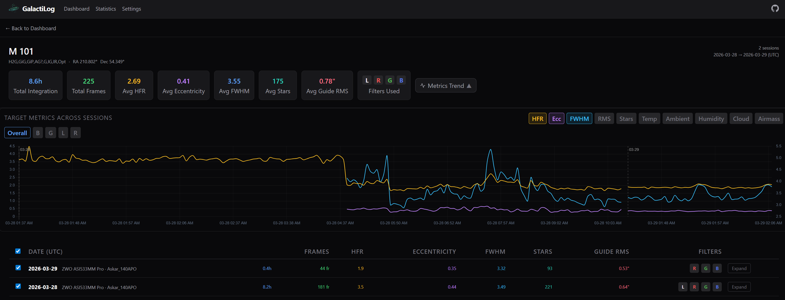
    </td>
    <td align="center" width="50%">
      <em>Session Metrics — per-frame data table, session insights, and interactive charts</em><br>
      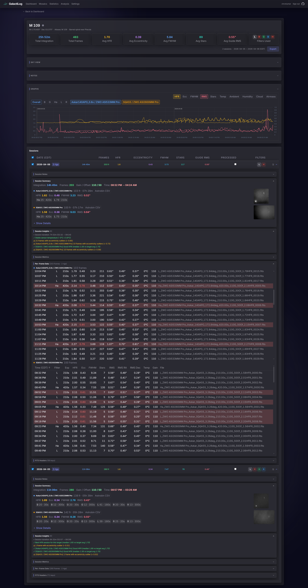
    </td>
  </tr>
</table>

### Mosaics

<table align="center">
  <tr>
    <td align="center" width="50%">
      <em>Mosaic browser — panel detection, keyword-based suggestions, and per-panel integration tracking</em><br>
      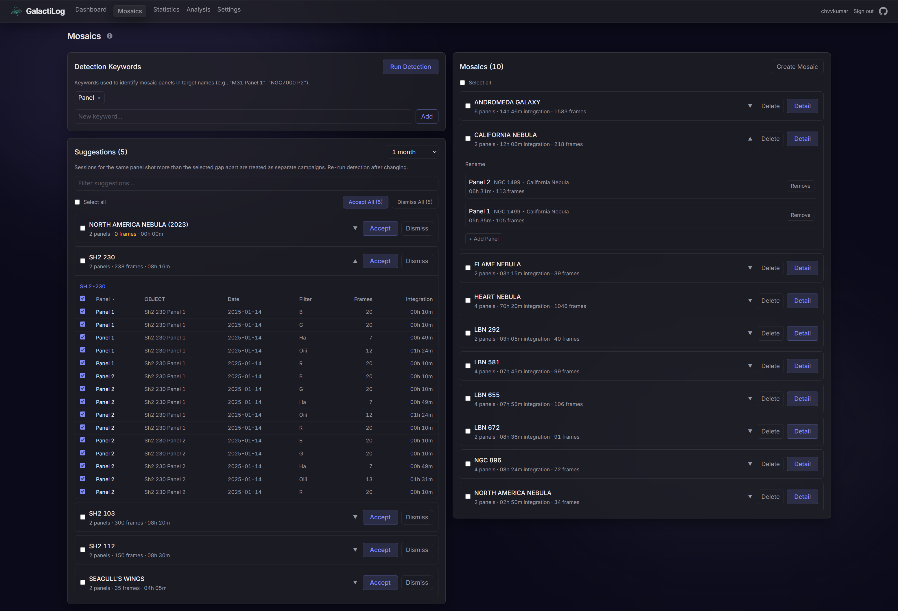
    </td>
    <td align="center" width="50%">
      <em>Mosaic detail — panel layout visualization with thumbnail grid and per-panel session data</em><br>
      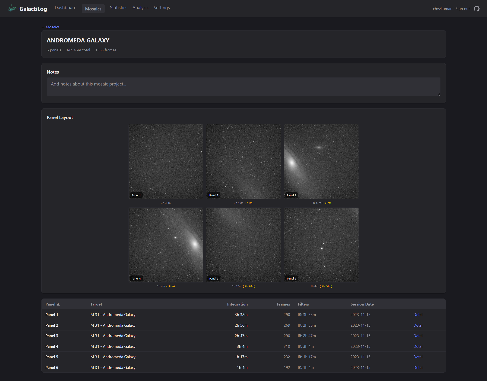
    </td>
  </tr>
  <tr>
    <td align="center" width="50%">
      <em>Mosaic detail — two-panel mosaic with integration summary and filter breakdown</em><br>
      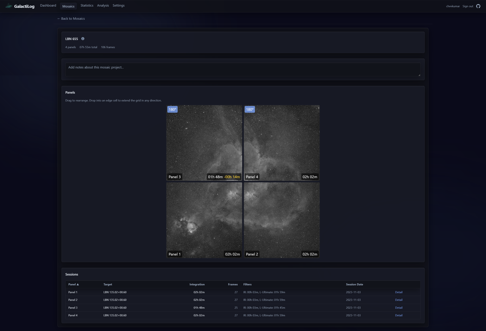
    </td>
    <td></td>
  </tr>
</table>

### Analysis & Statistics

<table align="center">
  <tr>
    <td align="center" width="50%">
      <em>Analysis — correlation explorer with scatter plots, trend lines, and statistical summaries</em><br>
      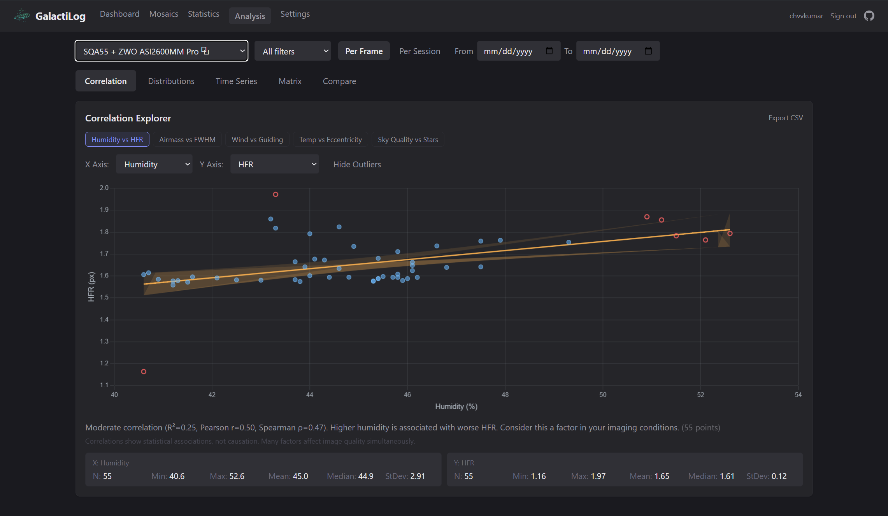
    </td>
    <td align="center" width="50%">
      <em>Statistics — integration totals, equipment performance, filter usage, and storage breakdown</em><br>
      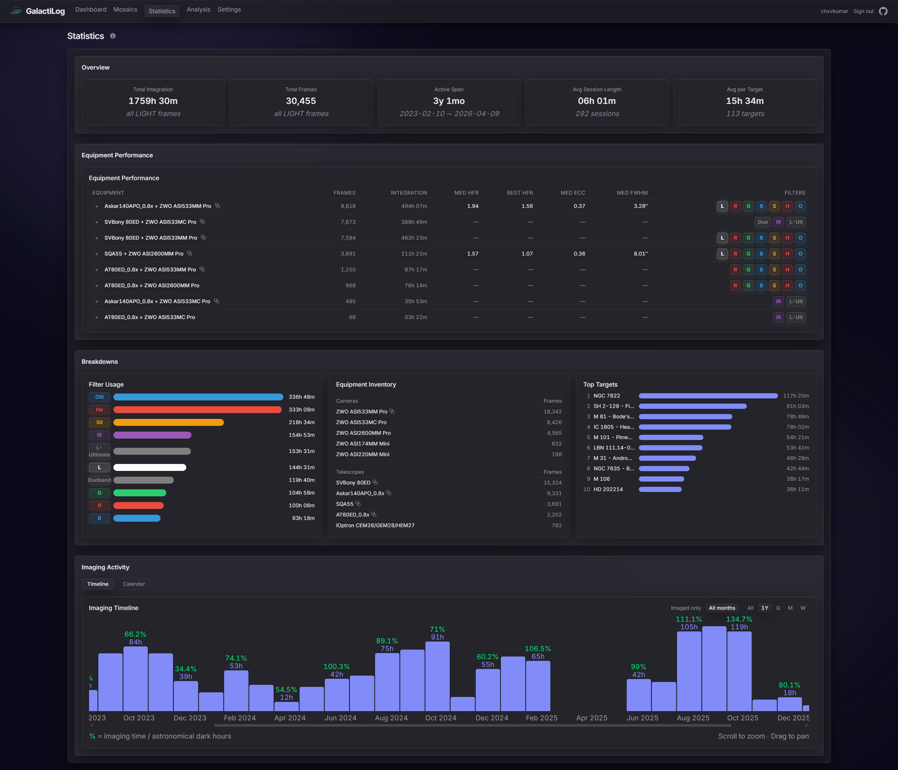
    </td>
  </tr>
</table>

<p align="center">
  <em>Imaging Timeline — monthly integration hours with dark-hour efficiency percentages</em><br>
  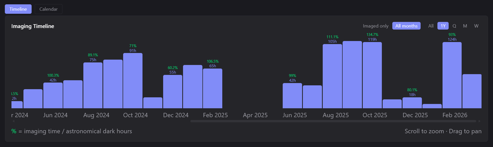
</p>

<p align="center">
  <em>Imaging Calendar — GitHub-style activity heatmap of imaging sessions by day</em><br>
  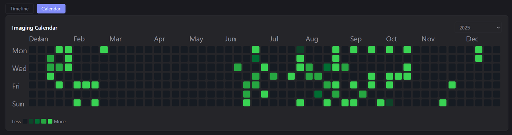
</p>

### Settings

<table align="center">
  <tr>
    <td align="center" width="50%">
      <em>Scan &amp; Ingest — auto-scan scheduler, ingest progress, and maintenance tools</em><br>
      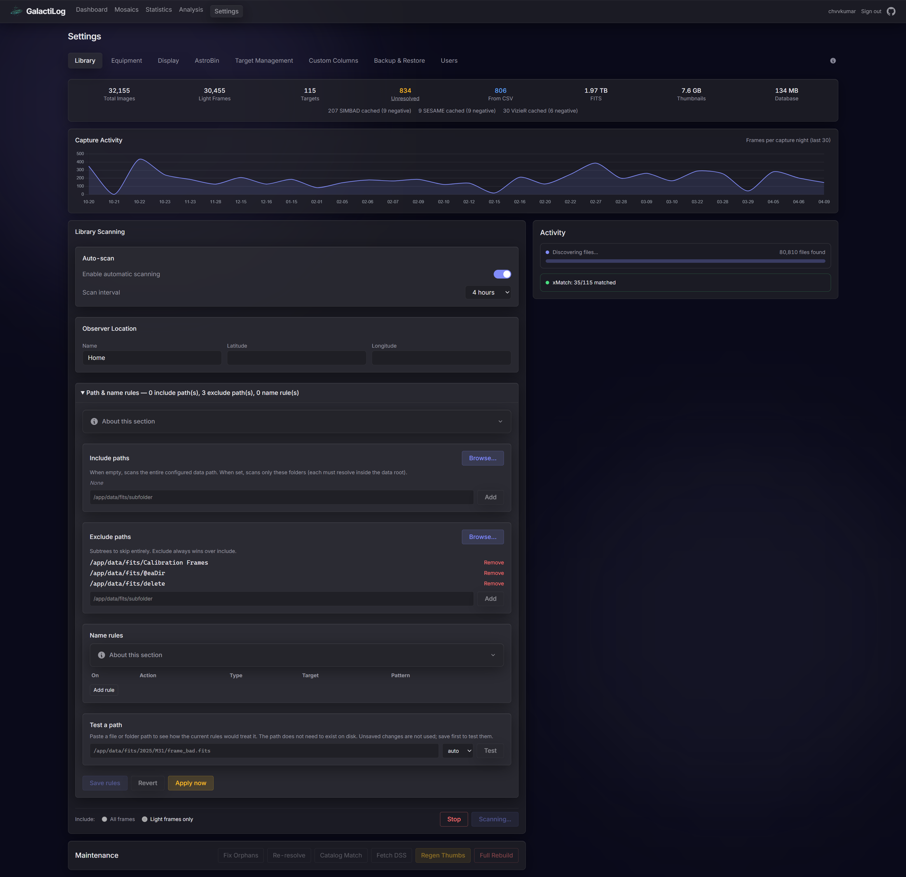
    </td>
    <td align="center" width="50%">
      <em>Filter Settings — duplicate detection, filter grouping, and per-filter frame counts</em><br>
      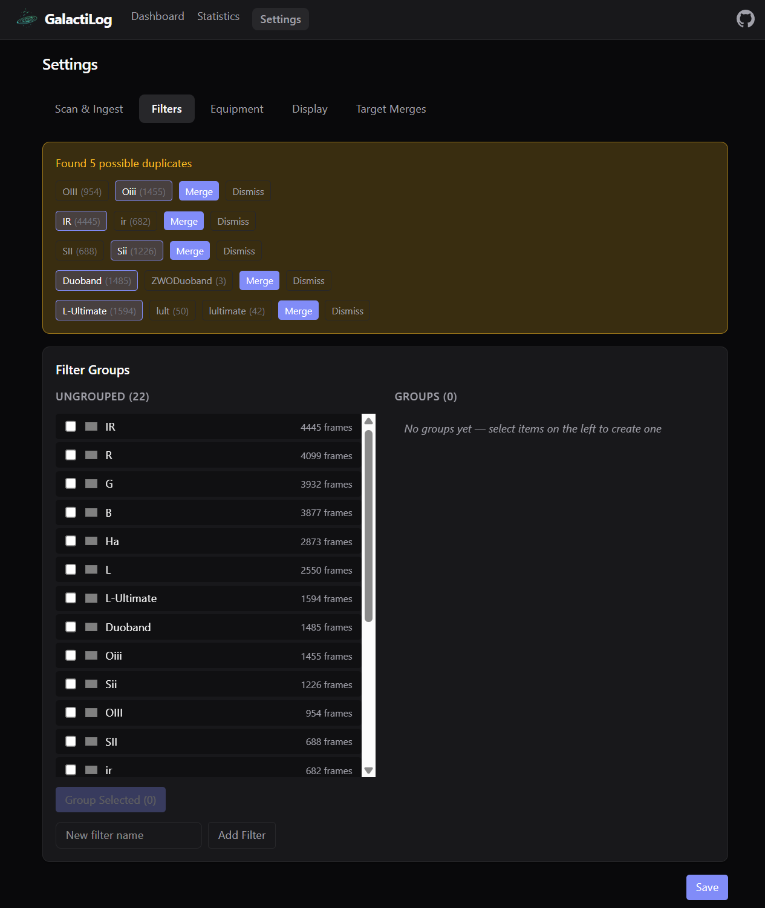
    </td>
  </tr>
  <tr>
    <td align="center" width="50%">
      <em>Equipment Settings — duplicate detection, camera and telescope grouping</em><br>
      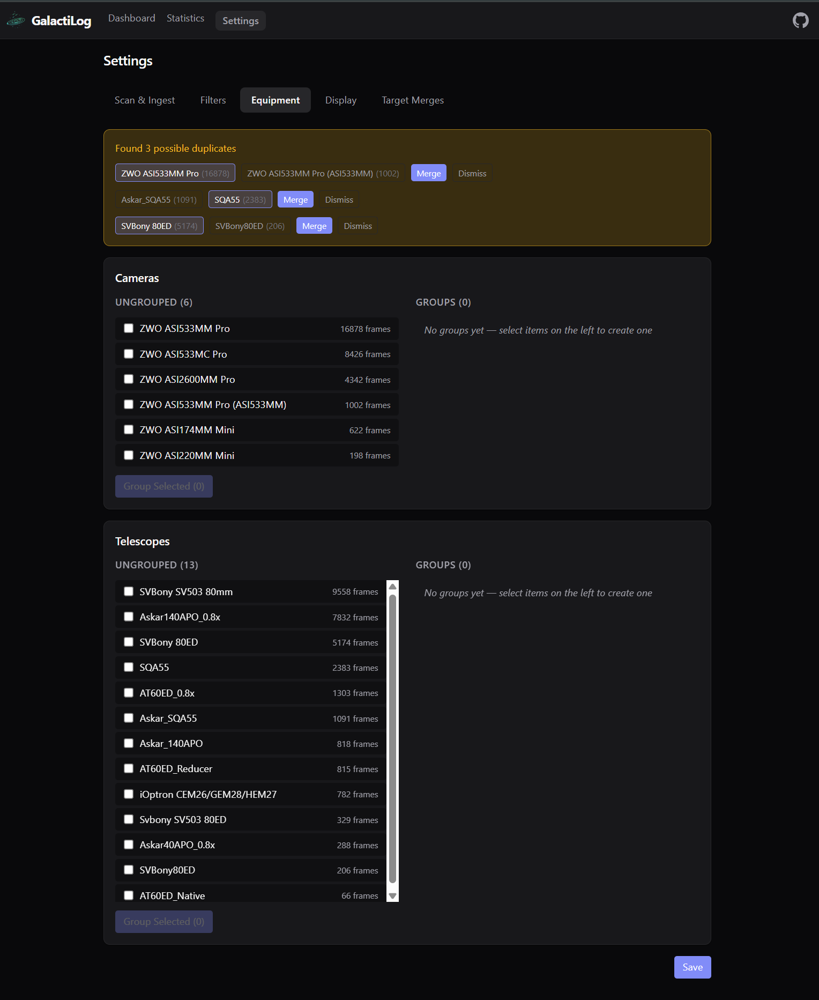
    </td>
    <td></td>
  </tr>
</table>

## Requirements

- **Docker** and **Docker Compose v2**
- **N.I.N.A.** (Nighttime Imaging 'N' Astronomy) for FITS file generation
- FITS files from N.I.N.A. imaging sessions
- Network access to [SIMBAD](https://simbad.cds.unistra.fr/) for target resolution (first-time only per target; results are cached locally)

## N.I.N.A. Dependencies

GalactiLog reads data produced by N.I.N.A. and its plugins. The table below lists what feeds into GalactiLog and what metrics it enables.

| Source | Required | Metrics Provided |
|--------|----------|-----------------|
| **N.I.N.A. Core** (FITS output) | Yes | Object name, exposure time, filter, camera, telescope, gain, sensor temp, capture date, image type |
| **FITS Headers** (HFR, FWHM) | No | Median HFR, FWHM, eccentricity (when written by N.I.N.A. to FITS headers) |
| **[Session Metadata](https://github.com/tcpalmer/nina.plugin.sessionmetadata) plugin** | No | Per-frame CSV files with extended metrics (see below) |
| **Guiding Plugin** (PHD2, internal) | No | Guiding RMS data captured by Session Metadata plugin |
| **Weather source** (OpenWeatherMap, ASCOM station, etc.) | No | Weather data captured by Session Metadata plugin |

The **Session Metadata** plugin for N.I.N.A. generates the CSV files that GalactiLog uses for extended analytics:

| CSV File | Metrics |
|----------|---------|
| `ImageMetaData.csv` | HFR, HFR stdev, FWHM, eccentricity, detected stars, guiding RMS (total/RA/Dec), ADU stats (mean/median/stdev/min/max), focuser position/temp, rotator position, pier side, airmass |
| `WeatherData.csv` | Ambient temperature, humidity, dew point, pressure, wind speed/direction/gust, cloud cover, sky quality/brightness/temperature |

See [N.I.N.A. Setup Guide](guides/NINA-SETUP.md) for detailed configuration instructions.

## Quickstart

```bash
# 1. Download the example compose file
curl -O https://raw.githubusercontent.com/chvvkumar/GalactiLog/main/docker-compose.example.yml

# 2. Copy and edit for your system (lines marked "<-- CHANGE")
cp docker-compose.example.yml docker-compose.yml
# Edit docker-compose.yml: set your FITS path, admin password, and port

# 3. Start
docker compose up -d

# 4. Open http://localhost:8080
```

Database migrations run automatically on first start. Log in with the admin credentials you set in the compose file, then trigger your first scan from the Settings page.

See [`docker-compose.example.yml`](docker-compose.example.yml) for all available options.

### Updating

```bash
docker compose pull app
docker compose up -d
```

### Using a specific version

Pin to a specific release tag in `docker-compose.yml`:

```yaml
# Stable release
image: chvvkumar/galactilog:1.0.0

# Pre-release (release candidate)
image: chvvkumar/galactilog:1.0.0-rc.1

# Latest stable (default)
image: chvvkumar/galactilog:latest

# Latest dev build
image: chvvkumar/galactilog:dev
```

For more details, platform-specific paths, or building from source, see the [Install Guide](guides/INSTALL.md).

## Guides

- [Install Guide](guides/INSTALL.md) -- Installation, updating, uninstalling, and troubleshooting
- [N.I.N.A. Setup Guide](guides/NINA-SETUP.md) -- Configuring N.I.N.A. for use with GalactiLog
- [Configuration Guide](guides/CONFIGURATION.md) -- Environment variables, themes, filter/equipment aliases, and display settings
- [Security Guide](guides/security.md) -- Authentication, HTTPS, cookie security, and user management

## Tech Stack

| Layer | Technology |
|-------|-----------|
| Frontend | SolidJS, TypeScript, Tailwind CSS v4, Chart.js, Vite |
| Backend | FastAPI, SQLAlchemy 2.0 (async), asyncpg, PostgreSQL 16 |
| Task Queue | Celery, Redis |
| Infrastructure | Docker Compose, Nginx, Supervisor |

## Acknowledgements

This application uses the following astronomical databases and services:

- **[SIMBAD](https://simbad.cds.unistra.fr/)** -- The SIMBAD database, operated at CDS, Strasbourg, France. ([Wenger et al., 2000, A&AS, 143, 9](https://ui.adsabs.harvard.edu/abs/2000A%26AS..143....9W))
- **[VizieR](https://vizier.cds.unistra.fr/)** -- The VizieR catalogue access tool, CDS, Strasbourg, France (DOI: [10.26093/cds/vizier](https://doi.org/10.26093/cds/vizier)). ([Ochsenbein et al., 2000, A&AS, 143, 23](https://ui.adsabs.harvard.edu/abs/2000A%26AS..143...23O))
- **[OpenNGC](https://github.com/mattiaverga/OpenNGC)** -- Database of NGC/IC objects by Mattia Verga, licensed under CC-BY-SA-4.0.

## License

This project is for personal use.
